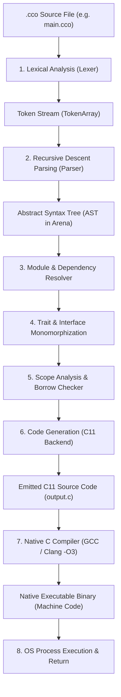
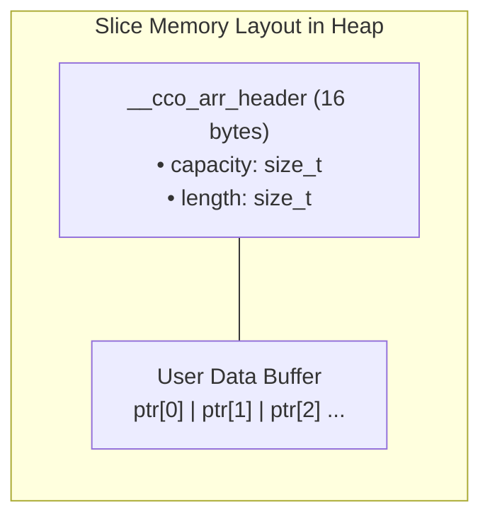
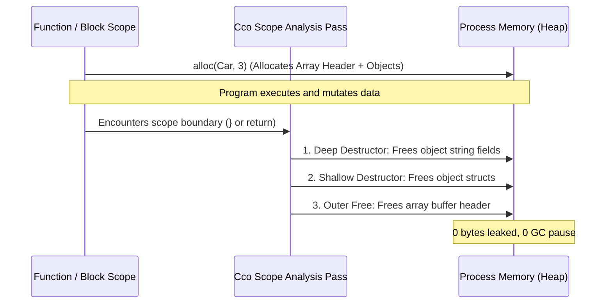

# Cco Language Architecture: Compilation, Memory Management & Execution Workflow

This document provides a comprehensive technical overview of how **Cco** source code (`.cco`) is parsed, analyzed, transformed into C11, compiled to native machine binaries, executed, and how memory is automatically created, resized, and freed with **zero memory leaks** and **zero garbage collection pauses**.

---

## 1. End-to-End Compiler Pipeline

The Cco compiler architecture operates as a modern multi-stage pipeline:



---

## 2. Deep Dive: Phase-by-Phase Breakdown

### Phase 1: Lexical Analysis (`src/lexer.c`)
- Reads raw UTF-8 `.cco` source files into memory.
- Scans characters and emits typed **Tokens** with exact line and column numbers:
  - **Keywords**: `fn`, `let`, `if`, `else`, `while`, `for`, `in`, `class`, `struct`, `enum`, `interface`, `impl`, `match`, `return`, `alloc`.
  - **Literals**: Integers (`100`), Floats (`3.14`), Strings (`"hello"`), Interpolated format strings (`f"count: {x}"`), Booleans (`true`, `false`).
  - **Identifiers and Operators**: `+`, `-`, `*`, `/`, `%`, `==`, `!=`, `<`, `>`, `&&`, `||`, `.`, `->`, `&`.

### Phase 2: AST Construction & Arena Allocation (`src/ast.c`, `src/parser.c`)
- Uses a **Recursive Descent Parser** with operator precedence climbing.
- Allocates all AST nodes in a fast, contiguous **Memory Arena (`AstArena`)**.
- **Performance Benefit**: The compiler allocates hundreds of thousands of AST nodes with zero individual `malloc()` overhead and frees the entire compiler AST in a single $\mathcal{O}(1)$ arena teardown.

### Phase 3: Module & Import Resolution (`src/module_resolver.c`)
- Analyzes `import "path/to/module.cco";` statements.
- Recursively parses imported files and merges their classes, structs, enums, interfaces, and function declarations into a single unified whole-program AST.
- Automatically tracks visited modules to prevent duplicate imports and circular dependency deadlocks without requiring C-style `#ifndef` include guards.

### Phase 4: Trait & Interface Monomorphization (`src/trait_resolver.c`)
- Validates that classes implementing interfaces satisfy all required method signatures.
- Resolves polymorphic method calls and monomorphizes generic implementations for direct C function dispatch, avoiding slow dynamic runtime lookups.

### Phase 5: Scope Analysis, Ownership & Auto-Free Annotation (`src/scope_analysis.c`)
- Builds lexical symbol tables for nested blocks, conditionals, loops, and functions.
- Enforces **Single Ownership Semantics** and tracks value movements:
  - Detects **use-after-move** errors at compile time.
  - Validates borrowed references (`&T`).
- Injects **deterministic deallocation tags** (`auto_free`, `release_old`, `retain_rhs`) onto every variable declaration and scope exit boundary.

### Phase 6: C11 Code Generation (`src/codegen.c` & `src/stdlib_prelude.h`)
- Translates the typed AST into clean, optimized standard **ISO C11**.
- Emits:
  - Struct and Class typedefs.
  - Method prototypes and mangled C functions.
  - String interpolation routines (`__cco_concat_free`, `__cco_int_to_str`, `__cco_float_to_str`).
  - Memory runtime helpers (`__cco_alloc_arr`, `__cco_free_arr`, `__cco_arr_maybe_grow`).
  - Injected cleanup calls before every block exit `}`, loop `break`, and `return` statement.

### Phase 7: Machine Compilation & Optimization
- Compiles the generated C11 source using `gcc -O3 -Wall -Wextra -std=c11 output.c -o binary -lm`.
- GCC applies hardware-level optimizations:
  - Register allocation and SIMD vectorization.
  - Function inlining and dead code elimination.
  - Linking with the system C runtime and math libraries (`-lm`).

---

## 3. Memory Architecture: Allocation, Growth & Deallocation

Cco provides **memory safety without a Garbage Collector (GC)**. Memory is allocated on the heap with metadata headers and freed deterministically via RAII (Resource Acquisition Is Initialization).



### 1. Dynamic Allocation (`alloc()`)
When you write:
```cco
let numbers: int[] = alloc(int, 4);
```
1. The runtime allocates memory for both the hidden header and the data:
   $$\text{Total Bytes} = \text{sizeof}(\texttt{\_\_cco\_arr\_header}) + N \times \text{sizeof}(T)$$
2. Initializes `hdr->capacity = N` and `hdr->length = N`.
3. Returns a pointer directly to the first element (`hdr + 1`), allowing standard C array indexing `numbers[i]` with native CPU speed.

### 2. Geometric Capacity Growth (`push()`)
When you append items using `push()`:
```cco
numbers = push(numbers, 100);
```
1. Checks if `hdr->length >= hdr->capacity`.
2. If full, dynamically doubles the capacity ($2\times$ geometric expansion: $0 \rightarrow 4 \rightarrow 8 \rightarrow 16 \dots$):
   ```c
   size_t new_cap = hdr->capacity == 0 ? 4 : hdr->capacity * 2;
   __cco_arr_header *new_hdr = realloc(hdr, sizeof(__cco_arr_header) + new_cap * elem_size);
   ```
3. Stores the element at index `hdr->length` and increments `hdr->length++`.
4. Provides amortized $\mathcal{O}(1)$ insertion time.

### 3. How Memory is Freed (Zero Leaks & Zero GC Pauses)

Unlike garbage-collected languages (Java, Go, Python) that freeze execution to scan memory, Cco uses **Deterministic Scope-Based Destruction**:

```cco
fn process_records() -> void {
    let data: int[] = alloc(int, 1000);
    // ... use data ...
    return; // <-- Cco automatically emits __cco_free_arr(data) HERE
}
```



#### Multi-Level Cascading Cleanup
For nested objects (e.g. array of `Car` objects containing string fields):
1. Cco emits a loop traversing the array buffer.
2. Calls destructor on each element, freeing dynamic strings and sub-objects.
3. Frees the outer array buffer header.
4. All memory returns to the operating system immediately.

---

## 4. Process Execution & Compilation Modes

Cco supports two primary execution workflows:

### Mode A: Direct Compile & Execute (`--run`)
Ideal for rapid development, scripting, and testing:
```bash
./cco codebase/195_dynamic_growable_list_44_items.cco --run
```
1. Parses and generates intermediate C code in `build/output.c`.
2. Invokes `gcc -O3` in the background.
3. Executes the resulting binary immediately and forwards its exit status code.

### Mode B: Standalone Native Binary Compilation
Ideal for production deployment and distribution:
```bash
# Step 1: Transpile Cco to optimized C11
./cco src/main_app.cco -o build/main_app.c

# Step 2: Compile to standalone native machine code
gcc -O3 -Wall -Wextra -std=c11 build/main_app.c -o bin/main_app -lm

# Step 3: Run standalone binary (No Cco compiler needed on target machine!)
./bin/main_app
```

---

## 5. Comparison: C vs Cco vs Garbage-Collected Languages

| Feature | Raw C | Cco Language | Garbage Collected (Go/Java) |
| :--- | :--- | :--- | :--- |
| **Compilation** | Direct to C object | `.cco` $\rightarrow$ C11 $\rightarrow$ Native Binary | Bytecode / Native VM |
| **Memory Allocation** | Manual `malloc()` / `calloc()` | Safe `alloc()` & `push()` | Runtime `new` / GC Allocator |
| **Memory Deallocation** | Manual `free()` (Error prone) | **Automatic RAII Scope Destructors** | Background Garbage Collector |
| **Runtime Latency** | Microsecond (Predictable) | **Microsecond (Predictable, 0 GC pause)** | Periodic Stop-The-World Pauses |
| **Memory Safety** | Unsafe (Dangling pointers, leaks) | **Safe (Ownership, Bounds Checks, RAII)** | Safe (Managed references) |
| **Valgrind Verification** | Requires manual auditing | **Guaranteed 0 errors, 0 leaks** | High runtime overhead |

---

## 6. Summary

The Cco execution pipeline brings together the **expressive syntax and safety of modern languages** with the **bare-metal speed and predictability of C**:

1. **Compile Time**: Validates syntax, types, modules, interfaces, and scopes; emits clean C11 with deterministic RAII destructor injection.
2. **Link Time**: Optimizes via GCC/Clang with hardware SIMD and inlining.
3. **Run Time**: Allocates metadata-aware slices, resizes with geometric $\mathcal{O}(1)$ growth, and deterministically frees all heap memory on scope boundaries with **0 memory leaks**.
